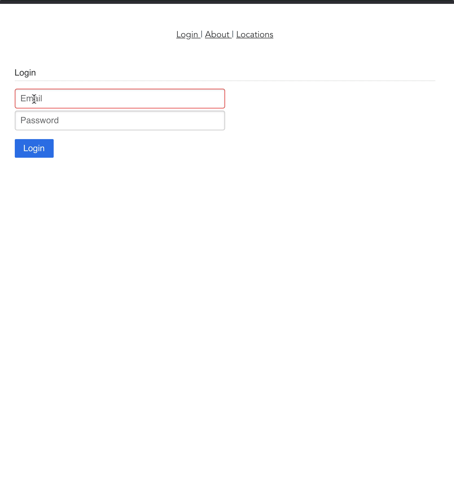

# Vue-Testing

This application is meant for demonstration purposes only.  It's designed to show a functioning user login system and the ability to integrate with multiple APIs.  



# Environment Variables

In order to run the application, two environment variables must be properly configured for two apis:
* Create an .env.local file from the current .env file
* [BreezyAPI](https://github.com/jonesmac/breezy-api/) - clone and setup repo
* In this app, verify the `VUE_APP_API_BASE` to the base url of the running Breezy API (i.e. http://localhost:3000/api/v1)
* In BreezyAPI, set `CORS_ALLOWED_ORIGIN` to your url for this app (i.e. http://localhost:8080)
* Get an api key from [Open Weather API](https://openweathermap.org/) and set it as `VUE_APP_OPEN_WEATHER_API_KEY` (**Note**: Free-tier is 60 requests per minute.)

# Login
Upon first visiting the application, you should see a login screen.  The test credentials from Breezy-API should be seeded with:
* email - john.doe@gmail.com
* password - password

# Locations
Upon successful login, you should be redirected to the Locations Page.  There, you can add your favorite locations with a label and zipcode.  As new locations are added to the list, you can delete them or view their current weather.

# Vue-CLI commands

## Project setup
```
yarn install
```

### Compiles and hot-reloads for development
```
yarn run serve
```

### Compiles and minifies for production
```
yarn run build
```

### Run your tests
```
yarn run test
```

### Lints and fixes files
```
yarn run lint
```

### Customize configuration
See [Configuration Reference](https://cli.vuejs.org/config/).
